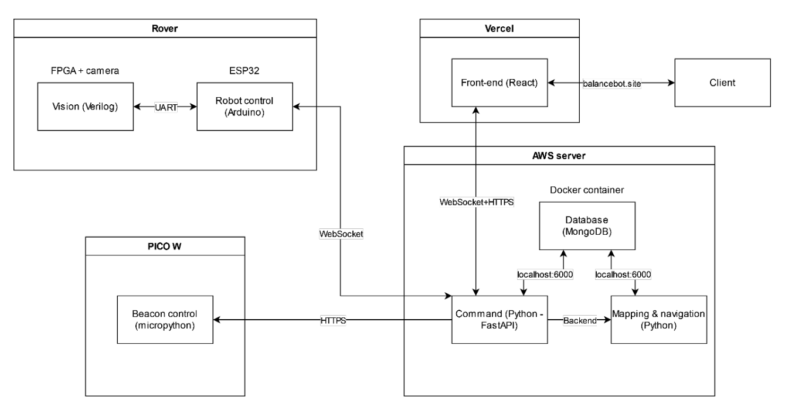
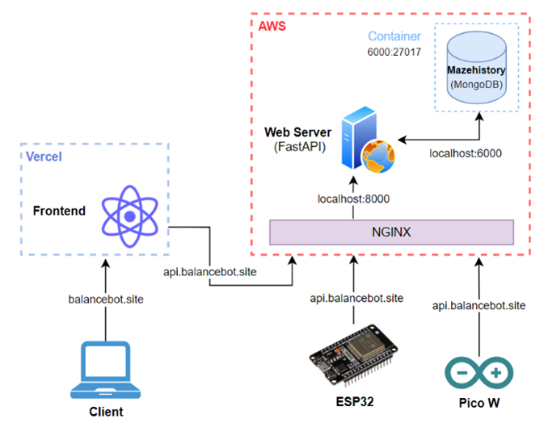

# BalanceBot

This repository contains source code produced for Imperial College 2nd Year Group Project (2023).

## What is this project?

This project presents the development of an autonomous self-balancing robot capable of mapping and navigating mazes. The main goals of the project were to achieve stable self-balancing motion, efficient maze exploration, and accurate path planning for the shortest route between arbitrary points. 

## High-level Architecture

## Team Members

Ajanthan Kanagasabapathy, Roshan Aekbote, Meigan Teo, William Ho, Tom Zhou, Martim Coutinho

## Personal contribution includes:

- Development and deployment of backend server on AWS:EC2 (See [webserver](webserver))
- Development of frontend web application using ReactJS (See [frontend](https://github.com/ajanthan-k/BalanceBot-Frontend))
- Communication interfaces between frontend - backend - rover + beacons (See [rover](https://github.com/ajanthan-k/BalanceBot/blob/main/esp32/control/integrated_control.ino#L567-L644), [beacons](https://github.com/ajanthan-k/BalanceBot/blob/main/power/blue_driver.py#L52-L75))

### Software Architecture

---

## Demo setup

1. Have web server running - with logs visible
2. Create hotspot (Balancebot / Ajanthan)
3. Setup beacons - check server logs to see if beacons connect and are polling 
4. Setup , which should auto connect to server
5. Open webapp on a device, and check if rover connected. 
6. If connected, run commands as desired.
